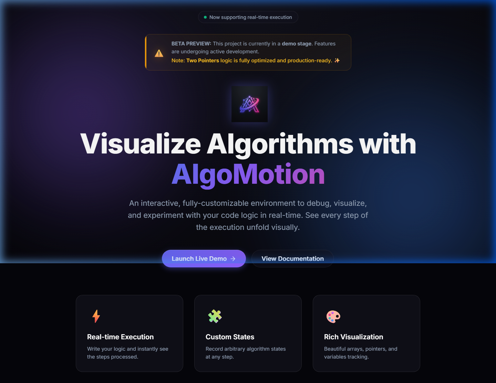

# AlgoMotion 📊✨

**Interactive Algorithm Execution Visualizer**

AlgoMotion is a browser-based tool that visually simulates how algorithms manipulate arrays and strings step-by-step. It helps developers and students debug logic through animated execution rather than manual dry runs.



## 🚀 Key Features

- **Interactive Workspace**: Input your own arrays, strings, and parameters.
- **Custom Logic Execution**: Write or edit algorithm snippets in JavaScript and see them executed in real-time.
- **Visual Execution Timeline**: Navigate through the algorithm's execution with Play, Pause, Next, and Previous controls.
- **Variable Inspector**: Track variable changes (like pointers, sums, and indices) via floating chips and explanation cards.
- **Premium UI**: Experience a modern, glassmorphic design with smooth Anime.js animations and a WebGL-powered background.

## 🛠️ Tech Stack

- **Frontend**: Vanilla HTML/CSS/JS
- **Bundler**: [Vite](https://vitejs.dev/)
- **Animations**: [Anime.js](https://animejs.com/)
- **Graphics**: [OGL](https://github.com/oframe/ogl) (for Prism WebGL background)
- **Styling**: Modern CSS with Glassmorphism and Backdrop Filters

## 🏃 Getting Started

### Prerequisites

- [Node.js](https://nodejs.org/) (v16.0.0 or higher recommended)
- Familiarity with JavaScript

### Installation

1.  **Clone the repository:**
    ```bash
    git clone https://github.com/your-username/algomotion.git
    cd algomotion
    ```

2.  **Install dependencies:**
    ```bash
    npm install
    ```

## 🚀 Core Features

- **Algorithm Execution Engine**: Custom JavaScript instrumentation and sandboxing for state capture.
- **Input Validation Layer**: Dedicated `InputParser` ensuring robust handling of arrays, strings, and parameters.
- **Dynamic Visualization**: Responsive rendering of array states, pointers, and variables using `anime.js` and `ogl`.
- **Customizable Logic**: Users can modify algorithm snippets in real-time with automatic recompilation.

## 🛠 Tech Stack

- **Core**: Vanilla JavaScript (ES Modules)
- **Visuals**: `anime.js` (Animations), `ogl` (WebGL Raymarching)
- **Styling**: Modern CSS with glassmorphism and premium themes
- **Bundler**: Vite

## 🚀 Getting Started

```bash
npm install
npm run dev
```

The application will be available at `http://localhost:3000/`.

## 📜 Documentation

Detailed technical information can be found in the `docs/` directory:

- [Architecture Overview](file:///d:/My_Projects/ALGO_CODE/docs/architecture.md)
- [Input Parsing & Validation](file:///d:/My_Projects/ALGO_CODE/src/engine/InputParser.js)
- [Bug Fix Log (Audit Session)](file:///d:/My_Projects/ALGO_CODE/docs/bug_fix_log.md)

## 🔮 Future Roadmap

We are committed to making AlgoMotion the ultimate multi-language visualization platform. Upcoming features include:

- **🐍 Python Support**: Execute and visualize Python snippets using [Pyodide](https://pyodide.org/).
- **☕ Java Support**: Implement client-side Java execution via [CheerpJ](https://cheerpj.com/).
- **📈 Graph & Tree Visualizations**: Expand beyond arrays and strings to support complex data structures.
- **☁️ Cloud Sync**: Save and share your custom algorithms and simulation states.

## 🤝 Contributing

Contributions are welcome! If you find a bug or have a feature suggestion, please open an issue or submit a pull request.

## 📄 License

This project is licensed under the MIT License - see the [LICENSE](LICENSE) file for details.
