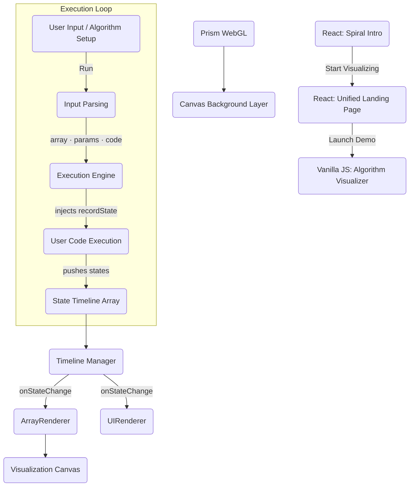

# AlgoMotion — Execution Architecture

The core of AlgoMotion operates on a strict **State Timeline Architecture**, fully separating algorithm execution from visual rendering.

## System Flow (Hybrid Architecture)

AlgoMotion uses a **Hybrid Architecture**: **React** handles the immersive UI (Intro/Landing), while **Vanilla JS** manages the high-performance execution engine and visualization.



---

## 1. Intro Animation System (`src/components/SpiralAnimation.jsx`)

The entry experience is built with **React** and **GSAP** for high-fidelity particle control:

- **SpiralAnimation**: A complex canvas-based particle engine simulating 5,000 "stars" moving along Fibonacci spiral paths.
- **GSAP Timeline**: Manages the 15-second recursive animation loop independently of the main thread.
- **State Management**: React handles the transition between the intro screen and the landing page, ensuring the intro only distracts once (or reloads as configured).
- **CSS Transitions**: Uses hardware-accelerated transforms and opacity fades for a smooth "gateway" feel.

---

## 2. Input Parsing & Validation (`src/engine/InputParser.js`)

The parsing logic is decoupled from the main UI orchestration via the `InputParser` class:

1. **`parseArray(input)`**: Validates that the comma-separated string contains only valid numbers (or quoted strings). Throws an error on non-numeric tokens.
2. **`parseCode(code)`**: Checks for basic syntax errors before instrumentation.
3. **`parseParams(json)`**: Safely parses the parameters using `JSON.parse`.

In `main.js`, the **▶ Run** button (and debounced input listeners) triggers this pipeline:
- The **Algorithm Type selector** auto-fills the logic snippet, parameters, AND recommended example data.
- This unified approach replaces the redundant "Demo" menu for a cleaner, preset-driven experience.

---

## 2. Execution Engine (`src/engine/ExecutionEngine.js`)

Securely evaluates user-defined JavaScript in a sandboxed `Function` scope.

- Wraps user code with `recordState` injected as a callable
- Parses `params` and injects each key as a `let` variable
- Catches runtime errors and returns `{ success: false, error: '...' }`
- Returns `{ success: true, states: [...] }` on completion

---

## 3. State Recording Format

Each `recordState()` call pushes an immutable snapshot:

```javascript
{
  array:     [2, 7, 11, 15],         // Current array values
  variables: { left: 0, right: 3, sum: 17 }, // Rendered as floating chips
  pointers:  { left: 0, right: 3 },  // Pointer arrow positions (by index)
  highlights: [0, 3],                // Array box indices to highlight
  operation: 'compare' | 'swap',     // Drives highlight CSS class
  status:    'sum < target → left++' // Explanation card text
}
```

---

## 4. Timeline Manager (`src/engine/TimelineManager.js`)

- Holds the full `this.states[]` array
- Controls: `.play()`, `.pause()`, `.next()`, `.previous()`, `.goToStep(idx)`, `.reset()`, `.setSpeed(multiplier)`
- Fires `onStateChange(state, index, total)` on every step change
- Fires `onPlaybackEnd()` when the last state is reached

---

## 5. Renderers (`src/renderers/`)

The render layer **never runs algorithms** — it only reacts to `TimelineManager` events.

### ArrayRenderer (`ArrayRenderer.js`)
- Manages `.array-container` DOM subtree inside `#visualization-canvas`
- `initialize(array)` creates array boxes; `reset()` removes **only** `.array-container` via `removeChild` — preserving the `#prism-bg` WebGL background and `#var-chips-overlay`
- Animates pointer movement with `anime.js` (smooth left-slide)
- Handles swap operation with cross-translate animations

### UIRenderer (`UIRenderer.js`)
- `renderVariableChips(variables)` — builds `.var-chip` pills into `#var-chips-overlay` (floating inside canvas)
- `updateTimeline(step, total)` — updates `#step-counter`, `#canvas-step-badge`, slider
- `updateExplanation(status)` — writes to `#explanation-text` inside the explanation card
- `reset()` — clears chips, resets badge and explanation text

---

## 6. Prism WebGL Background (`src/prism.js`)

A vanilla JS port of the `Prism` WebGL effect using the [`ogl`](https://github.com/oframe/ogl) library.

- `initPrism(container, options)` → returns a cleanup function
- Renders a raymarched prism/pyramid shader into a full-bleed `<canvas>` inside `#prism-bg`
- Canvas is `position: absolute; inset: 0; z-index: 0; pointer-events: none` — purely decorative
- Current settings: `animationType: 'rotate'`, `timeScale: 0.2`, `hueShift: 1.8` (violet/amber palette match), `colorFrequency: 0.7`, `glow: 0.75`
- `ResizeObserver` keeps render resolution in sync with container size

**Dependency**: `npm install ogl`

---

## 7. UI Layout & Interactivity

AlgoMotion features a highly interactive UI designed for flexibility and focus.

### Draggable Resizers
The interface is split into three main areas using LeetCode-style draggable panes:
- **Vertical Resizer (`#resizer-v`)**: Adjusts the balance between the **Setup Panel** (left) and the **Visualization Area** (right).
- **Horizontal Resizer (`#resizer-h`)**: Dynamically resizes the **Visualization Canvas** height relative to the **Control Strip** and bottom components.
- Implementation is handled via mouse events in `main.js`, updating CSS `flex-basis` and `width` properties in real-time.

### Real-time Execution & Debouncing
To provide immediate feedback, the system compiles and runs user code as they type:
- **Debounced Execution**: Changes to array inputs, parameters, or logic snippets trigger `runVisualization` after a **400ms delay** to prevent performance stuttering mid-typing.
- **Feedback Loop**: Syntax errors or parse failures are caught and displayed in the explanation card, ensuring a smooth developer experience.

---

## 8. Visual Layer Z-Index Stack (inside `#visualization-canvas`)

| Layer | Element | z-index |
|---|---|---|
| WebGL background | `#prism-bg` → `<canvas>` | 0 |
| Array elements | `.array-box` | 10 |
| Pointer arrows | `.pointer-indicator` | 20 |
| Variable chips | `.var-chips-overlay` | 30 |
| Step badge | `.canvas-header` | 100 |

---

## 9. Future Language Support

The frontend visualization (Steps 4 & 5) is fully decoupled from the execution runtime (Steps 1–2).

### Approach A: Remote Backend (Recommended)
Replace `ExecutionEngine.js` with a `fetch()` call to a backend that sandboxes foreign code (Python/Java) and returns the `states[]` JSON array directly into `TimelineManager`.

### Approach B: Client-Side WASM
- **Python**: [Pyodide](https://pyodide.org/) — map Python dicts to JS State objects
- **Java**: [CheerpJ](https://cheerpj.com/) — heavier but fully browser-based
